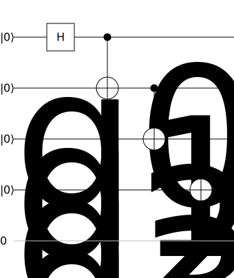

# QuRest: A REST-full Approach for Hybrid Quantum-Classical Circuit Modeling
[](https://opensource.org/licenses/Apache-2.0)
[](https://github.com/StuttgarterDotNet/qurest/actions/workflows/dotnet.yml)

QuRest is an academical prototype with the intention to show how **classical control structures** like loops and conditionals can be implemented in a **gate-based quantum circuit model**. 
We achieve this by introducing so-called **model variables**, i.e. variables that needs to be mapped to real values at compile-time but can be used freely when modelling a quantum circuit.


The following example shows the preparation of a *GHZ-State* with *n* qubits using a for loop:

```csharp
var qc = new QuantumCircuit()
    .WithName("N-Qubit-GHZ")
    .WithDescription("Prepares a N qubit GHZ state.")
    .WithSize("N")
    .H("0")
    .For("i", "0", "N-1", "1") // for (var i = 0; i < N-1; i++)
        .CX("i", "i+1")
    .EndFor();
```

The output of the compilation with *N=4*:

<div style="text-align:center">

</div>

## Disclaimer of Warranty
Unless required by applicable law or agreed to in writing, Licensor provides the Work (and each Contributor provides its Contributions) on an "AS IS" BASIS, WITHOUT WARRANTIES OR CONDITIONS OF ANY KIND, either express or implied, including, without limitation, any warranties or conditions of TITLE, NON-INFRINGEMENT, MERCHANTABILITY, or FITNESS FOR A PARTICULAR PURPOSE.
You are solely responsible for determining the appropriateness of using or redistributing the Work and assume any risks associated with Your exercise of permissions under this License.

## Haftungsausschluss
Dies ist ein Forschungsprototyp.
Die Haftung für entgangenen Gewinn, Produktionsausfall, Betriebsunterbrechung, entgangene Nutzungen, Verlust von Daten und Informationen, Finanzierungsaufwendungen sowie sonstige Vermögens- und Folgeschäden ist, außer in Fällen von grober Fahrlässigkeit, Vorsatz und Personenschäden, ausgeschlossen.
